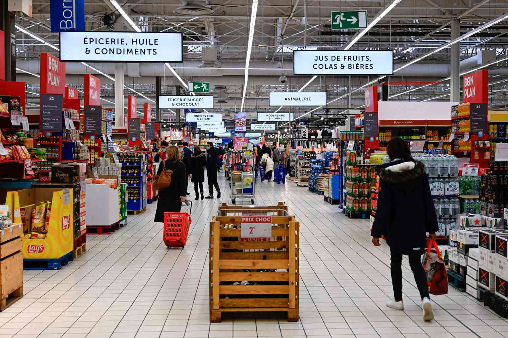

# Customer Segmentation Project

## Table of Contents
- [Project Overview](#project-overview)
- [Data Source](#data-source)
- [Objectives](#objectives)
- [Tools and Technologies](#tools-and-technologies)
- [Project Workflow](#project-workflow)
- [Data Collection](#data-collection)
- [Data Preparation](#data-preparation)
- [Clustering Analysis](#clustering-analysis)
- [Visualization and Insights](#visualization-and-insights)
- [Results](#results)
- [Conclusion](#conclusion)
- [Future Work](#future-work)
- [Acknowledgments](#acknowledgments)

## Project Overview
This project aims to segment customers based on their purchasing behavior to identify distinct customer groups. Understanding these segments can help businesses tailor marketing strategies and improve customer satisfaction.

## Data Source
The dataset used for this project is sourced from Kaggle, which contains customer transaction data. You can access the dataset [here](https://www.kaggle.com/datasets/prasad22/retail-transactions-dataset).

## Objectives
- Segment customers based on purchasing behavior.
- Identify key characteristics of each customer segment.
- Provide actionable insights for targeted marketing strategies.

## Tools and Technologies
- **SQL**: Data extraction and initial preparation.
- **Python**: Data cleaning, preprocessing, and clustering (using Pandas and Scikit-Learn).
- **Tableau**: Data visualization and dashboard creation.
- **Jupyter Notebook**: Documentation and analysis.

## Project Workflow
1. **Data Collection**: Gather customer transaction data.
2. **Data Preparation**: Clean and preprocess the data.
3. **Clustering Analysis**: Apply clustering algorithms to segment customers.
4. **Visualization and Insights**: Visualize the segments and extract insights.
5. **Results**: Summarize the findings and present the segments.

## Data Collection
The dataset was collected from Kaggle and includes the following columns:
- `Transaction_ID`
- `Date`
- `Customer_Name`
- `Product`
- `Total_Items`
- `Total_Cost`
- `Payment_Method`
- `City`
- `Store_Type`
- `Discount_Applied`
- `Customer_Category`
- `Season`
- `Promotion`

## Data Preparation
Steps taken to prepare the data:
- Extracted relevant features using SQL queries from the original Kaggle dataset.
- Transformed and aggregated the data to create the following features:
  - `Customer_Name`
  - `Num_Visits`: Number of visits.
  - `Total_Spent`: Total amount spent by the customer.
  - `First_Purchase_Date`: Date of the first purchase.
  - `Last_Purchase_Date`: Date of the last purchase.
  - `Recency`: Days since the last purchase.
  - `Avg_Spend`: Average amount spent per visit.
  - `Avg_Items`: Average number of items purchased per visit.
  - `Discount_Usage`: Frequency of discount usage.
  - `Preferred_Payment_Method`: Most frequently used payment method.
  - `City`: City of the customer.
  - `Customer_Category`: Customer category.
- Cleaned and preprocessed the data using Python (Pandas).
- Scaled features for clustering.
- Converted date fields to datetime format.

Please refer to the SQL script called "Customer_Segment_Query.sql" provided above for more details on how we extracted relevant features.
Also, refer to the Jupyter Notebook with the file name "Customer Segmentation.ipynb" for the data cleaaning and preprocessing the data needed for the clustering algorithm called K-Means clustering algorithm.
 
## Clustering Analysis
- Used K-means clustering algorithm from Scikit-Learn.
- Determined the optimal number of clusters using the elbow method, which was found to be K=3.
- Added a `Cluster` column to the dataset based on the clustering results using the labels 0, 1, and 2.

Please refer to the Jupyter Notebook with the file name "Customer Segmentation.ipynb" for more information about the clustering analysis, including a pairplot and centroids of each of the 3 clusters for further analysis.

## Visualization and Insights
- Created various visualizations using Tableau to analyze customer segments:
  - Cluster distribution bar chart.
  - Preferred payment method per cluster.
  - Customer category per cluster.
  - City distribution per cluster.
  - Average purchase value per cluster.
  - Purchase frequency per cluster.

[Link to Tableau Dashboard](https://public.tableau.com/app/profile/daniel.lam7659/viz/CustomerSegmentationDashboard_17173973617210/ClusterAnalysis)

## Results

### Overall Insights

#### Cluster 0 (Bargain Seekers)
- **Visit Frequency**: Moderate
- **Total Spend**: Moderate
- **Average Spend per Visit**: Moderate
- **Discount Usage**: Higher

#### Cluster 1 (High-Spenders)
- **Visit Frequency**: Infrequent
- **Total Spend**: Low
- **Average Spend per Visit**: High
- **Discount Usage**: Moderate

#### Cluster 2 (Low-Spenders)
- **Visit Frequency**: Infrequent
- **Total Spend**: Low
- **Average Spend per Visit**: Low
- **Discount Usage**: Moderate

Customers in Cluster 2 (Low-Spenders) are infrequent visitors with the lowest total and average spending per visit. They purchase a similar number of items per visit and have low discount usage, similar to Cluster 1 (High-Spenders).

### Key Characteristics and Behaviors of Each Segment
- **Bargain Seekers**: Customers in this segment have a moderate visit frequency and spending pattern. They tend to use discounts more frequently, which suggests they are price-sensitive and respond well to promotions.
- **High-Spenders**: These customers visit infrequently but spend a high amount per visit. They use discounts moderately, indicating they are likely to make significant purchases but are less price-sensitive compared to Bargain Seekers.
- **Low-Spenders**: Characterized by infrequent visits and low spending, both in total and per visit. Their moderate use of discounts suggests they are not highly motivated by promotional offers.

### Actionable Insights for Targeted Marketing Strategies
- **Bargain Seekers**: Implement targeted promotions and discount offers to maintain and potentially increase their visit frequency and spending. Personalized discounts and loyalty programs could be effective.
- **High-Spenders**: Focus on strategies to increase visit frequency, such as exclusive events or early access to new products. Offering high-value items and premium services can cater to their high spending per visit.
- **Low-Spenders**: Develop strategies to boost engagement and encourage more frequent visits. This could include personalized communication, incentives for repeat visits, and introductory offers for new products or services.

By leveraging these insights, businesses can tailor their marketing efforts to better meet the needs and preferences of each customer segment, ultimately enhancing customer engagement and satisfaction.

<!-- 
## How to Run the Project
You can run this project directly on GitHub by following these steps:

1. **Clone the repository**:
   - Click the "Code" button on the repository page and select "Open with GitHub Desktop" or copy the URL to clone it using your preferred method.

2. **GitHub Codespaces**:
   - If you have access to GitHub Codespaces, you can open this project in a codespace by clicking the "Code" button and selecting "Open with Codespaces".

3. **Run Jupyter Notebooks**:
   - Navigate to the `notebooks` directory (if available) and open the Jupyter notebooks using the GitHub interface or GitHub Actions to run the notebooks automatically.

4. **Using GitHub Actions**:
   - If the repository includes GitHub Actions workflows, they can automate parts of the process. You can trigger these workflows from the "Actions" tab on the repository page.
-->

## Conclusion

The customer segmentation analysis revealed distinct customer groups with unique purchasing behaviors and preferences. Key findings include:

- **Bargain Seekers**: Customers with moderate visit frequency, moderate total and average spend, and higher discount usage.
- **High-Spenders**: Infrequent visitors with high average spend per visit and moderate discount usage.
- **Low-Spenders**: Infrequent visitors with the lowest total and average spending per visit, and moderate discount usage.

These insights can be leveraged to enhance customer engagement and optimize marketing efforts by tailoring strategies to each segment's characteristics. For instance, targeted promotions can be designed for Bargain Seekers who are responsive to discounts, while strategies to increase visit frequency might be effective for High-Spenders and Low-Spenders.

By understanding and addressing the needs of each customer segment, businesses can improve customer satisfaction, loyalty, and overall profitability.

## Future Work
- **Integrate Additional Data Sources**: Enhance the analysis by incorporating more data sources, such as demographic information, social media interactions, or customer feedback, to provide a more comprehensive view of customer behavior and preferences.
- **Explore Other Clustering Algorithms and Techniques**: Investigate different clustering methods, such as hierarchical clustering, DBSCAN, or Gaussian Mixture Models, to compare their performance and potentially uncover more nuanced customer segments.
- **Implement Predictive Modeling for Customer Behavior**: Develop predictive models to forecast future customer behavior, such as purchase likelihood, churn prediction, or lifetime value estimation, enabling proactive and targeted marketing strategies.
- **Segment Validation and Profiling**: Conduct further validation of the clusters using techniques like silhouette analysis or gap statistics and create detailed profiles for each segment to better understand their characteristics.
- **Real-Time Segmentation**: Implement real-time customer segmentation in a production environment, allowing businesses to dynamically adjust marketing strategies based on the latest customer data.
- **Custom Marketing Strategies**: Design and test customized marketing strategies for each segment, measuring the impact on customer engagement and conversion rates to refine and optimize these strategies over time.

## Acknowledgments
- **Kaggle**: For providing the dataset.
- **Family and Friends**: For their encouragement and support.
